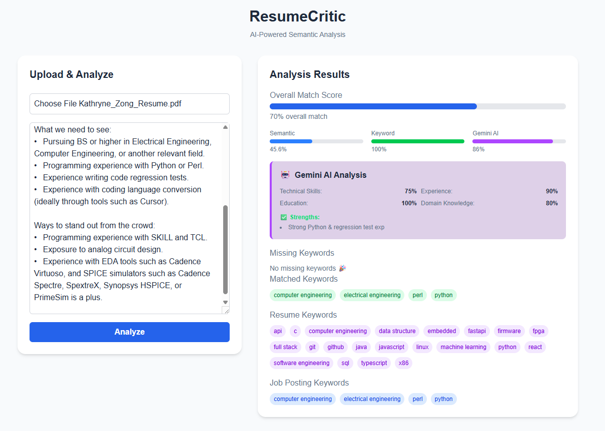

# ResumeCritic

**AI-Powered Resume Analysis Platform**

ResumeCritic is a full-stack web application that analyzes resumes against job descriptions using multiple methods: rule-based keyword matching, semantic similarity, and optional AI evaluation (Google Gemini). The frontend is built with Next.js (TypeScript + Tailwind) and the backend is a FastAPI service that performs text extraction, keyword & OR-group matching, semantic embedding comparisons, and optional LLM analysis.

---

## Quick overview / architecture

- Frontend (Next.js) — user uploads a resume and pastes a job description, then displays results.
- Backend (FastAPI) — single endpoint `POST /api/analyze`:
  - Extract text from resume (pdfplumber for PDFs; decode text files)
  - Keyword extraction and OR-group handling (rule-based)
  - Semantic similarity using sentence-transformers (all-MiniLM-L6-v2) + cosine similarity
  - Optional Google Gemini LLM analysis (if `GEMINI_API_KEY` is configured)
  - Score aggregation and JSON response to frontend

Data flow (high level): Browser → Next.js UI → POST /api/analyze → Backend processing (PDF extraction → Keywords / OR groups → Embeddings → Optional LLM) → Aggregator → JSON response → UI.

---

## Features

- Multi-method analysis: rule-based keywords + semantic similarity + optional LLM.
- Smart keyword extraction: technical whitelist (initially in code).
- OR-group handling: recognizes alternatives (e.g., "Python or Java").
- Semantic similarity: uses sentence-transformers to capture contextual matches beyond exact tokens.
- AI insights (optional): Google Gemini returns structured feedback (scores, strengths, gaps, recommendation).
- PDF support: `pdfplumber` extracts text from PDF resumes.
- Modern UI: Next.js + TypeScript + TailwindCSS.
- Theme support: Dark/light with `next-themes`.

---

## Design decisions

- Combined approach (keywords + semantic)  
  Rule-based keywords are interpretable and allow deterministic matches (and easy feedback like "missing keywords"). Semantic similarity catches paraphrases and context that keywords miss. Combining both gives a more robust, explainable signal.

- OR-group handling  
  Job posts often list alternatives (e.g., "Python or Java"). Treating those as a single logical requirement avoids double-penalizing candidates who meet one of the alternatives.

- Optional LLM integration (Google Gemini)  
  Gemini provides richer recruiter-like feedback (strengths/gaps, recommendation). Because LLM calls are slower and costly, integration is optional and gated by `GEMINI_API_KEY`. If not configured, the app still returns keyword + semantic scores.

---

## Evolution — how the project grew

1. Keyword matching (initial)  
   - Start: simple rule-based extraction from job text and resume text using a built-in whitelist. Provided immediate, interpretable matches and a quick MVP.

2. Semantic similarity (added later)  
   - Motivation: keyword-only matching missed paraphrases and contextual matches.  
   - Change: added sentence-transformers (all-MiniLM-L6-v2), encoded resume + job texts, and computed cosine similarity to score semantic fit.

3. AI integration (latest, optional)  
   - Motivation: get recruiter-style qualitative feedback (strengths, gaps, recommendation) and a supplemental score.  
   - Change: introduced an optional call to Google Gemini (via google-genai) that asks for structured JSON analysis. The backend merges Gemini's overall_score into the final score when available.

---

## Setup Guide

This guide will help you get both the backend and frontend running.

### Prerequisites

- Python 3.9+ installed
- Node.js and npm installed
- Google Gemini API key (optional, for AI analysis - get one at https://makersuite.google.com/app/apikey)

## Step 1: Backend Setup

### 1.1 Navigate to backend directory
```bash
cd backend
```

### 1.2 Activate virtual environment (if you have one)
On Windows:
```bash
venv\Scripts\activate
```

On Mac/Linux:
```bash
source venv/bin/activate
```

### 1.3 Install dependencies
```bash
pip install -r requirements.txt
```

### 1.4 Start the backend server
```bash
uvicorn app.main:app --reload --port 8000
```

You should see output like:
```
INFO:     Uvicorn running on http://127.0.0.1:8000
```

**Keep this terminal window open!** The backend needs to keep running.

## Step 2: Frontend Setup

### 2.1 Open a NEW terminal window
(Keep the backend terminal running)

### 2.2 Navigate to frontend directory
```bash
cd frontend
```

### 2.3 Install dependencies (if not already done)
```bash
npm install
```

### 2.4 Start the frontend development server
```bash
npm run dev
```

You should see output like:
```
- ready started server on 0.0.0.0:3000
```

## Step 3: View the Application

Open your browser and go to:
**http://localhost:3000**

You should see the ResumeCritic interface!

## Restarting the Backend

If you need to restart the backend:

1. **Stop the server**: In the backend terminal, press `Ctrl+C`
2. **Start it again**: Run `uvicorn app.main:app --reload --port 8000`

The `--reload` flag means the server will automatically restart when you make code changes.

## Troubleshooting

### Backend won't start
- Make sure you're in the `backend` directory
- Check that your virtual environment is activated
- Verify all dependencies are installed: `pip install -r requirements.txt`
- Make sure port 8000 is not already in use

### Frontend won't start
- Make sure you're in the `frontend` directory
- Try deleting `node_modules` and running `npm install` again
- Check that port 3000 is not already in use

### API connection errors
- Make sure the backend is running on port 8000
- Check that the `.env` file exists in the `backend` directory with your `GEMINI_API_KEY`
- If Gemini API is not configured, the app will still work but AI analysis will be disabled

## Quick Commands Reference

**Backend:**
```bash
cd backend
venv\Scripts\activate  # Windows
# or
source venv/bin/activate  # Mac/Linux
uvicorn app.main:app --reload --port 8000
```

**Frontend:**
```bash
cd frontend
npm run dev
```

**View app:**
- Open http://localhost:3000 in your browser

---

## Tech Stack

### Backend
- **FastAPI** - Modern Python web framework
- **Uvicorn** - ASGI server
- **sentence-transformers** - Semantic similarity using all-MiniLM-L6-v2 model
- **scikit-learn** - Cosine similarity calculations
- **pdfplumber** - PDF text extraction
- **google-genai** - Google Gemini AI integration
- **numpy** - Numerical operations

### Frontend
- **Next.js 16** - React framework with server-side rendering
- **React 19** - UI library
- **TypeScript** - Type-safe JavaScript
- **TailwindCSS 4** - Utility-first CSS framework
- **next-themes** - Theme management

### AI & NLP
- **Sentence Transformers** - For semantic similarity analysis
- **Google Gemini** - For comprehensive resume evaluation and insights
- **Rule-based Keyword Matching** - Technical keyword extraction from requirement sections

---

## Demo



